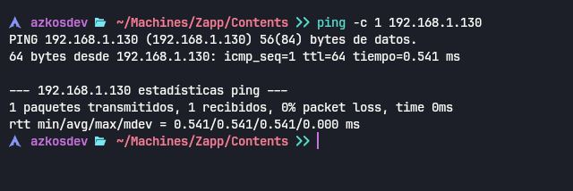
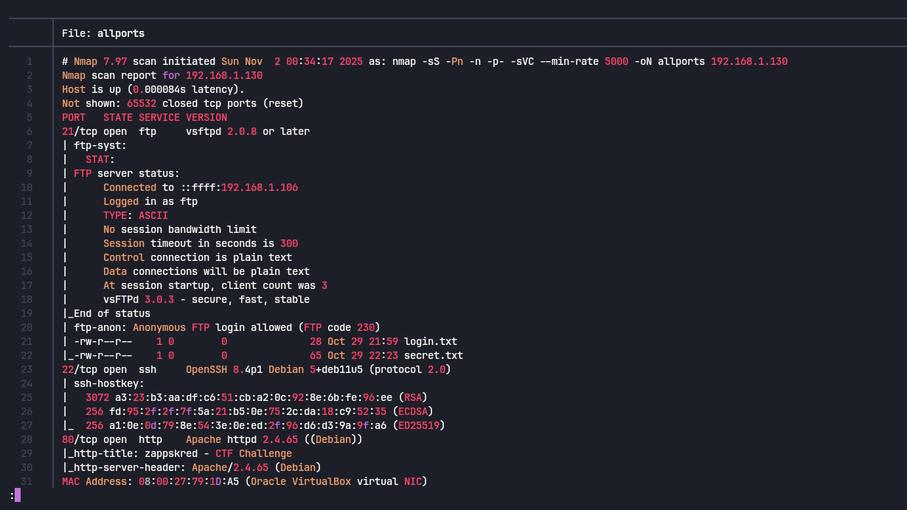
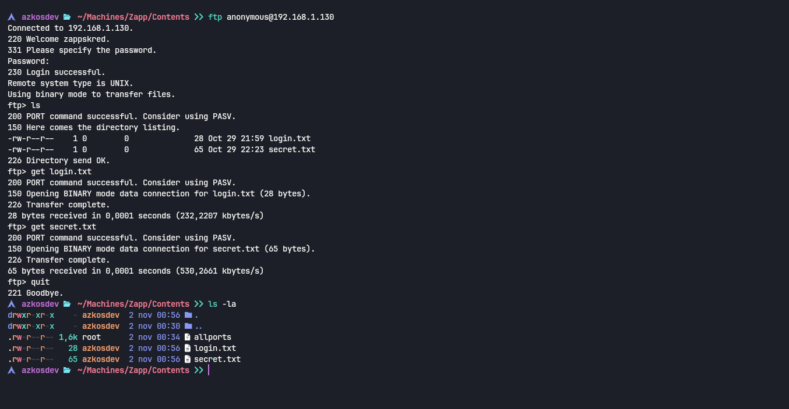
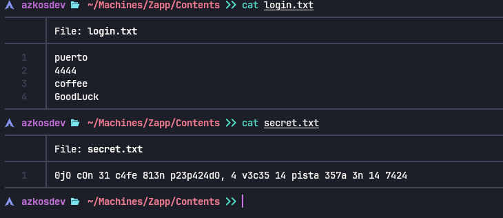
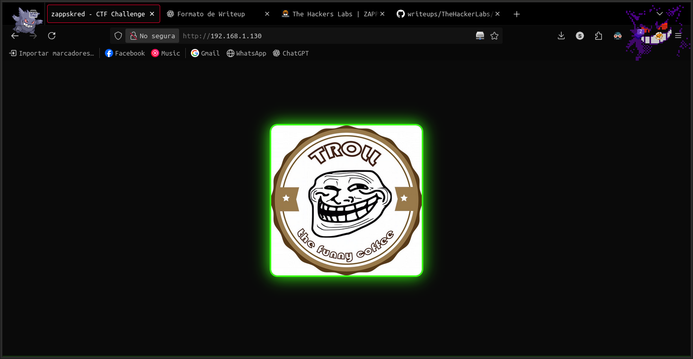
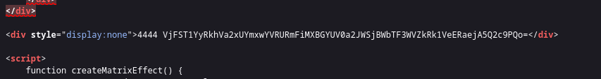
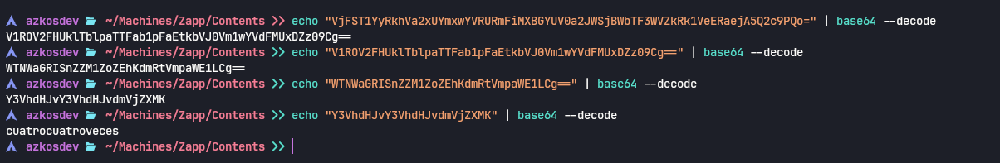
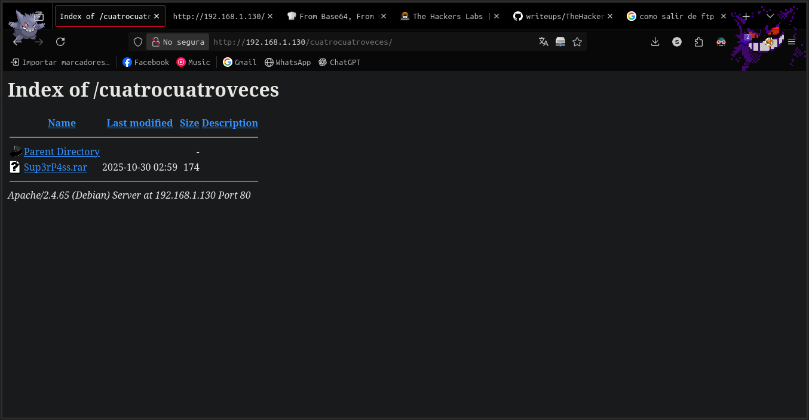
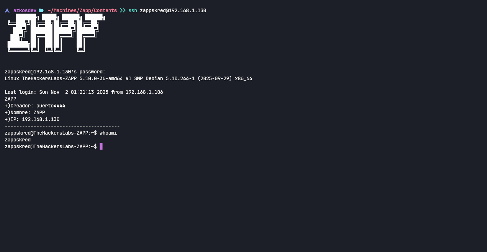
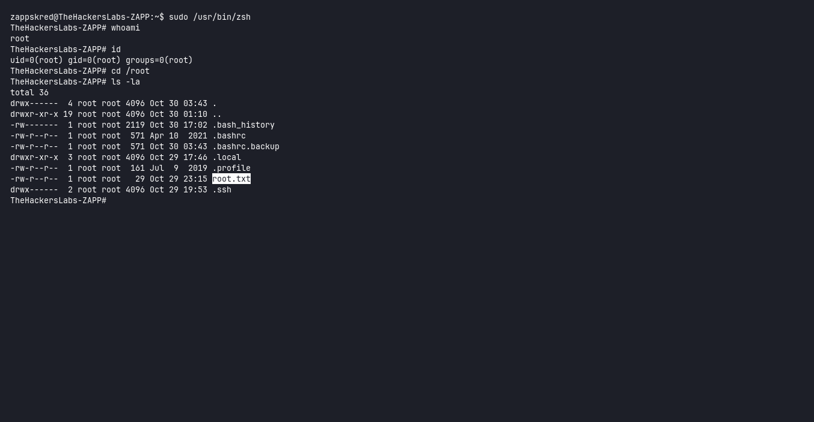

# 🖥️ Write-Up: [Zapp](https://labs.thehackerslabs.com/machine/143)

## 📌 Información General
    - Nombre de la máquina: Zapp
    - Plataforma: The Hackers Labs
    - Dificultad: Principiante
    - Creador: Puerto444X
    - OS: Linux
    - Objetivos: Obtención de la Flag de usuario y de root

---

## 🔍 Enumeración

Nuestra ip es la **192.168.1.106**

La máquina Zapp tiene la ip **192.168.1.130**

### Descubrimiento de Puertos

Comenzamos con lo mas basico realizando un PING a la maquina para identificar que la maquina se encuentre con conexion.




Seguido de esto realizamos un escaneo con la herramienta **NMAP**. Para descubrir que puertos se encuentran abiertos dentro de la maquina.
Usamos el siguiente comando
```bash
sudo nmap -sS -Pn -n -p- -sVC --min-rate 5000 192.168.1.130 -oN allports
```



- El puerto 21 está ejecutando un servicio de vsftpd con una version 2.0.8.
- El puerto 22 está ejecutando un servicio de OpenSSH.  
- El puerto 80 está ejecutando un servicio web con Apache.

### Puerto 21

Si nos damos cuenta el escaneo de nmap nos da como resultado que el puerto 21 se encuentra habilitado el login como anonymous y que dentro de esta se encuentran 2 archivos **secret.txt**, **login.txt**



si vemos los dos archivos dentro nos muestra lo siguiente:



el secret por lo que veo nos quiere decir algo como "Ojo con el cafe bien preparado, A veces la pista esta en la taza"
y el login nos muestra posibles usuarios o contraseñas no lo sabemos

### Puerto 80

Si accedemos al sitio web desde el navegador podemos observar lo siguiente.



Si nos vamos al codigo fuente de la pagina podemos observar un div extraño que parese codificado en base64.
 




Decodificamos este codigo pero nos vuelve a dar un codigo en base64 asi que lo volvemos a pasar y lo mismo hasta un total de 4 veces, asi hasta que nos de la palabra  **cuatrocuatroveces** posible contraseña? seguiremos buscando.


Despues de esto trato de hacer un fuzzing de directorios con la herramienta **gobuster** para ver que mas podiamos encontrar, encontramos una ruta llamada **/pass.txt**
pero viendo el tamaño del size si vamos dentro de ella no encontramos nada, se encuentra vacio 

Despues de un largo tiempo de tratar con hydra y con fuerza bruta y nada me daba, hasta que decidi coger el base64 que decodificamos con anterioridad y ponerlo como ruta y bingo



Dentro de este se encuentra una posible credencial de acceso y si tratamos de descomprimir nos pide claramente una password asi que para esto usaremos la herramienta **john**


Despues de un rato encontramos la contraseña asi que descomprimimos el archivo y nos da una posible contraseña **3spuM4**, y un mensaje que nos dice intenta porbar con mas.

## Acceso SSH

trate de hacer fuerza bruta con los archivos que nos dieron por el puerto ftp pero nada me daba haci que decidi buscar detenidamente por la web y en el titulo tenia un posible username **zappskred**, asi que probamos estas credenciales y estamos dentro.




## Escalada de Privilegios

La escalada de privilegios fue bastante sencilla lo unico que hicimos fue ingresar que comandos podiamos ejecutar como root y nos dio que le binario zsh lo podiamos ejecutar como root

asi que simplemente solo ejecutamos el siguiente comando para lanzarnos una zsh **sudo /usr/bin/zsh** y ya estaremos como root


